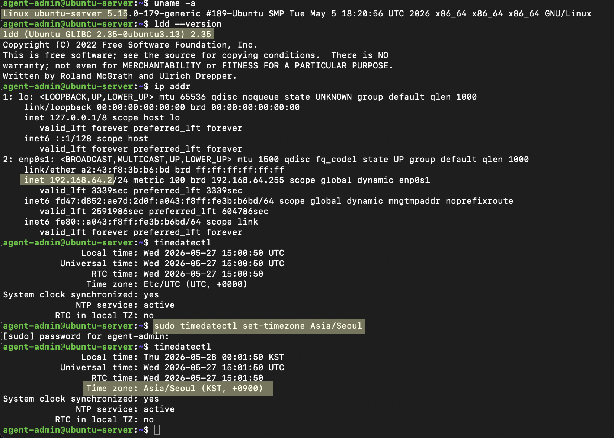
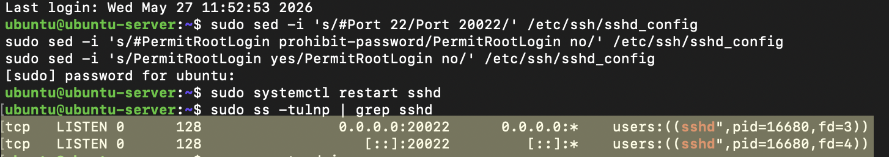
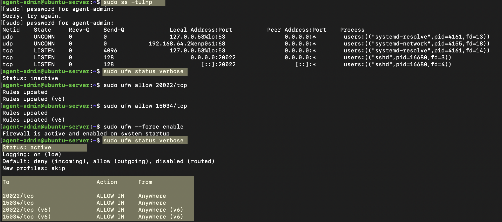
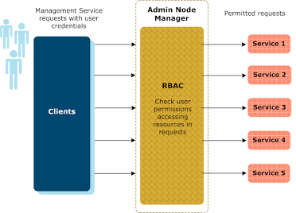
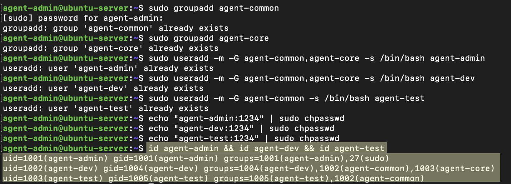
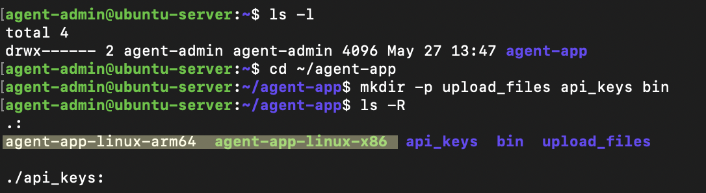
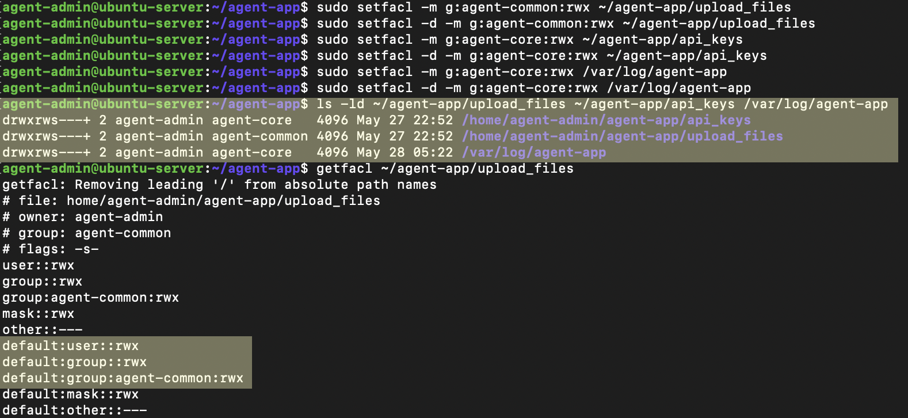
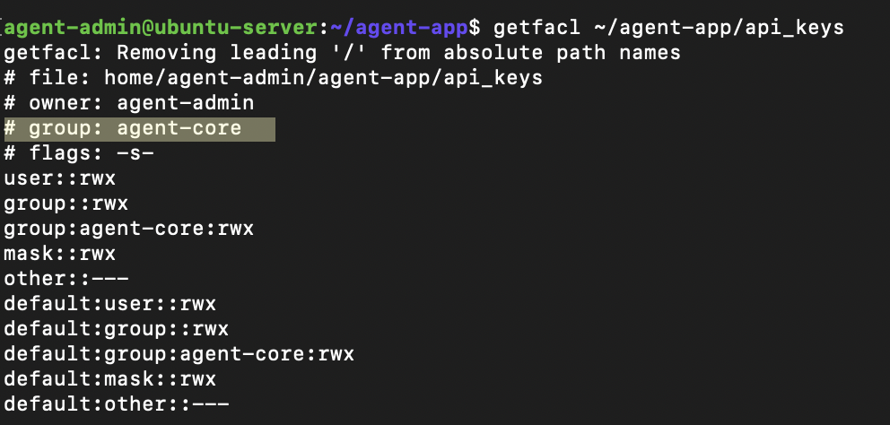
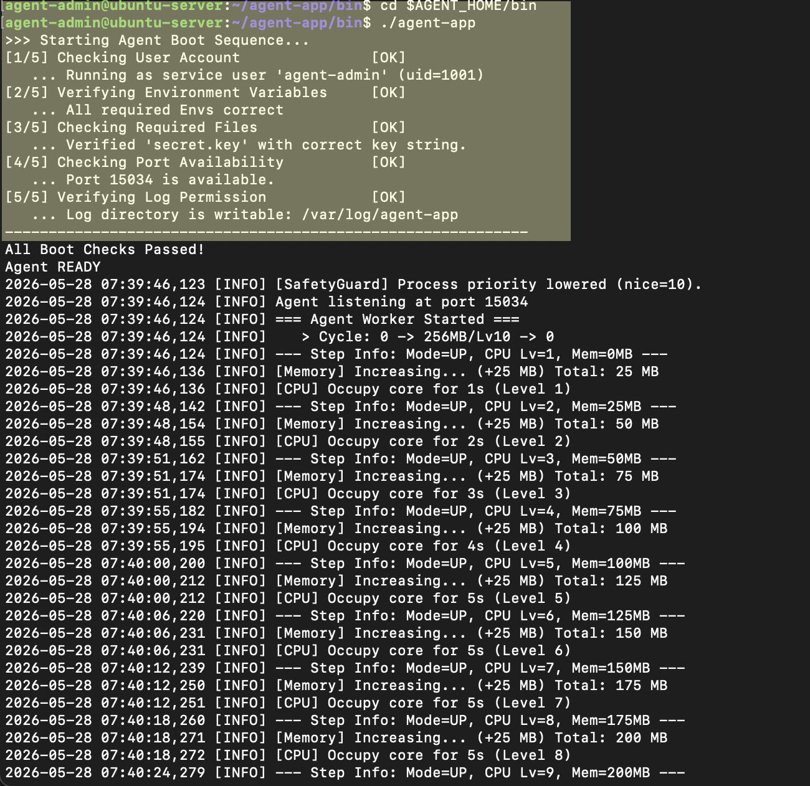

# 🚀 리눅스 시스템 관제 자동화 프로젝트 (b1-1)

본 프로젝트는 리눅스 서버 환경에서 **네트워크 보안(SSH/방화벽), 사용자 계정 권한 격리, 디렉토리 위계 설계, 시스템 리소스 실시간 모니터링 및 로그 관리 자동화**를 설계하고 구현한 과정을 담고 있습니다.


---
## 🛠️ 0. 가상 인프라 구축 및 트러블슈팅

실습에 앞서, 관리자 권한(`sudo`)이 제한된 교육장 공용 Mac 환경에서 실제 상용 서비스 서버와 100% 동일한 보안 실습 환경을 만들기 위해 아래와 같이 환경을 구성하고 문제를 해결했습니다.
Ubuntu 서버 실습을 위해 Mac 환경에서 Linux VM 환경을 함에 있어, 관리자 권한 없이도 실제 서버와 최대한 동일한 환경을 만드는 것이 목표였습니다.


### 🔍 1) 가상화 도구 선택: OrbStack vs UTM

#### [후보 검토]
| 항목 | OrbStack | UTM |
| :--- | :--- | :--- |
| **설치 방식** | Homebrew로 간편 설치 | DMG 직접 설치 가능 |
| **가상화 방식** | 컨테이너 기반 (Docker 유사) | 완전한 VM (QEMU 기반) |
| **실제 서버와의 유사도** | 낮음 (커널 공유) | ✅ 높음 (독립 커널) |
| **네트워크 설정** | 제한적 | ✅ 실제 서버와 동일하게 설정 가능 |
| **SSH 설정** | 자동 처리됨 | ✅ 직접 설정 필요 (실습 적합) |
| **방화벽(UFW)** | 제한적 | ✅ 완전히 동작 |
| **성능** | 가벼움 | 상대적으로 무거움 |
| **과제 적합도** | ⚠️ 부분적 | ✅ **완전히 적합** |

- **OrbStack (선택 안 함):** 가볍지만 Mac 호스트의 커널을 공유하는 `컨테이너 방식`입니다. 이로 인해 SSH 포트 변경이나 UFW 방화벽 제어, 계정권한 등을 실제서버처럼 완전히 독립적으로 설정하기 어려움을 확인하였습니다. 따라서 orbstack으로는 "독립된 서버 보안 실습"을 완벽하게 재현하기 어려워 제외했습니다.

- **UTM (✅ 최종 선택):** 완전한 하드웨어 가상화(QEMU)를 지원하여 실제 서버와 동일하게 독립된 Linux 커널을 구동합니다. 방화벽, 네트워크, 계정 권한 관리를 실제 IDC 환경처럼 완벽하게 커스텀할 수 있어 최종 선택했습니다. 또한 Ubuntu Server ISO를 직접 설치하므로 실제 서버 배포와 동일한 경험을 쌓을 수 있었습니다. 

- **결정:** ✅ **UTM 선택** (실제 서버 환경과 100% 동일한 환경 구성 가능)

### ❌ 2) 공용 PC의 홈브루(`Homebrew`) 권한 거부 해결 과정
- **문제 현상:** 터미널에서 `brew install --cask utm` 실행 시, 공용 PC 특성상 주요 폴더의 쓰기 권한이 제한되어 `Permission denied` 에러가 발생했습니다.

- **원인 분석:** 기존 설치된 홈브루 폴더의 소유주가 현재 로그인한 계정과 달라 발생한 문제였으며, 공용 PC라 관리자 패스워드를 알 수 없어 권한 변경이 불가능했습니다.

- **해결 방법:** 패키지 매니저 설치 대신 **UTM 공식 홈페이지에서 `.dmg` 파일을 다운로드**하여, 유저 전용 개인 폴더(`~/Applications/`)에 수동으로 복사 배치함으로써 관리자 권한 없이 설치를 성공시켰습니다.

#### 관리자 권한 우회용 수동 설치 스크립트 

```bash
mkdir -p ~/Applications
hdiutil attach ~/Downloads/UTM.dmg
cp -R /Volumes/UTM/UTM.app ~/Applications/
hdiutil detach /Volumes/UTM
open ~/Applications/UTM.app
```
---
## 💻 1. 개발 환경 정보 (Environment)

| 항목 | 내용 |
| :--- | :--- |
| **Host OS** | macOS Sequoia (v15.7.4) |
| **가상화 환경** | UTM |
| **Guest OS** | Ubuntu Server 24.04 LTS |
| **Architecture** | x86_64 (intel core i5)|
| **Terminal** | Mac 기본 터미널 + SSH 원격접속|


## 📊 [추가] 세부 시스템 및 네트워크 환경 정보

| 항목 (Item) | 상세 내용 (Details) | 관련 명령어 | 의미 및 비고 |
| :--- | :--- | :--- | :--- |
| **Guest OS 아키텍처** | `x86_64` (64-bit) | `uname -a` | Intel 계열 가상화 아키텍처 확인 |
| **GLIBC 버전** | `v2.35` | `ldd --version` | C 표준 라이브러리 구동 버전 |
| **가상 머신 IP 주소** | `192.168.64.2` | `ip addr` | SSH 및 SCP 접속용 가상 내부 IP |
| **시스템 시간대** | `Asia/Seoul (KST, +0900)` | `timedatectl` | 한국 표준시(KST) 설정 완료 |

> 💡 **환경 교정 기록:** > 가상 머신 최초 빌드 시 시스템 시간대가 `Etc/UTC`로 설정되어 있는 것을 확인하여, `sudo timedatectl set-timezone Asia/Seoul` 명령어를 통해 한국 표준시(KST)로 수동 교정 완료함.

### 📷 우분투 세부 환경 검증 스크린샷

---
## 🔒2. SSH 보안 설정 (포트 격리 & 루트 접속 차단)  

서버를 개설하면 기본 포트인 22번을 노린 해커들의 무차별 대입 공격(Brute-Force) 스캔이 실시간으로 들어옵니다. 

포트를 임의의 번호(20022)로 바꾸는 것만으로도 대다수의 자동화 공격을 원천 차단할 수 있습니다. 

또한, 모든 권한을 가진 최고 관리자(root) 계정의 다이렉트 로그인을 막아 비밀번호 탈취 시 서버가 통째로 넘어가는 위험을 예방합니다.

```bash
# SSH 설정 파일에서 기본 포트를 20022로 변경하고 root 로그인 차단 설정

sudo sed -i 's/#Port 22/Port 20022/' /etc/ssh/sshd_config
sudo sed -i 's/#PermitRootLogin prohibit-password/PermitRootLogin no/' /etc/ssh/sshd_config
sudo sed -i 's/PermitRootLogin yes/PermitRootLogin no/' /etc/ssh/sshd_config

# 변경 사항 적용을 위해 SSH 서비스 재시작

sudo systemctl restart sshd
````

#### 정상작동검증
```bash
sudo ss -tulnp | grep sshd
```



- 서버가 20022포트에서 정상적으로 응답을 기다리고있는지 확인 됨(listen)

- SSH 서비스(sshd)가 프로세스 번호 16680번으로 아주 건강하게 잘 작동하고 있는 점 확인 됨.    

---
## 🛡️3. UFW 방화벽 설정 (화이트리스트 정책)

방화벽의 기본 원칙은 **"필요한 문만 열어두고 나머지는 싹 다 닫는 것(화이트리스트)"**입니다.

문이 많이 열려있을수록 외부 공격자가 침투할 수 있는 통로(공격 표면)가 넓어지기 때문입니다. 

본 프로젝트에서는 오직 `운영 목적의 SSH 포트` 와 `에이전트 전용 포트` 만 허용하고 나머지는 철저히 격리합니다.

```bash

# 현재 서버에서 열려있는(수신 대기 중인)포트 확인하기
sudo ss -tulnp

# 현재 방화벽의 상태 최종 확인하기 
sudo ufw status verbose -> `status: inactive` 확인 됨

# 필수 서비스 포트만 선택적으로 허용

1. 방금 검증한 20022번 SSH 포트 허용
sudo ufw allow 20022/tcp  # 보안 SSH 포트

2. 에이전트 앱이 사용한 15034번 포트 허용
sudo ufw allow 15034/tcp  # Agent App 전용 포트

# 방화벽 엔진 활성화 (기존 원격 접속 유지 옵션 포함)
sudo ufw --force enable
```

#### 정상 작동 검증

```bash
sudo ufw status verbose
```

- 방화벽(`ufw`) 상태를 확인하여 보안 포트 20022(SSH)와 에이전트 전용 포트 15034가 정상적으로 허용(ALLOW)되었는지 검증완료 

---
## 👥 4. 사용자 계정 및 직무 그룹 관리 (RBAC 구조)


### 1.개별 사용자 계정 생성 (`useradd`)

리눅스 환경에서 다수의 팀원이 공용 계정(root, ubuntu)을 공유하면 

1)작업 이력 역추적이 불가능하고 2)한 명의 실수가 시스템 전체에 치명적인 영향을 줄 수 있습니다. 

따라서 최소 권한 원칙(Principle of Least Privilege)에 따라 직무 역할에 맞는 개별 계정을 생성합니다.


- RBAC (Role-Based Access Control, 역할 기반 접근 제어).   

시스템 권한을 사용자 개인에게 직접 부여하지 않고, 직무에 따른 '역할(Role/Group)'에 권한을 할당한 뒤 사용자를 해당 역할에 매핑하는 보안 관리 모델입니다. 이를 통해 대규모 인프라에서도 권한 관리를 효율적이고 안전하게 자동화할 수 있습니다.

```bash
# 1. 공통 및 코어 보안용 직무 그룹 생성
sudo groupadd agent-common
sudo groupadd agent-core

# 2. 직무별 개별 사용자 계정 생성 및 권한 분리
sudo useradd -m -G agent-common,agent-core -s /bin/bash agent-admin
sudo useradd -m -G agent-common,agent-core -s /bin/bash agent-dev
sudo useradd -m -G agent-common -s /bin/bash agent-test
```
💡 핵심 옵션 및 실무적 의미 파악하기


`sudo`: 사용자 생성 및 그룹 할당은 시스템 핵심 환경을 변경하는 작업이므로 최고 관리자(Root) 권한을 강제합니다.

`-m` (Make Home): 사용자가 로그인 후 독립적으로 작업할 수 있는 전용 홈 디렉토리(/home/계정명)를 자동으로 생성합니다. 생략 시 홈 디렉토리가 부재하여 정상적인 쉘 세션 유지가 불가능합니다.

`-G` (Secondary Group): 사용자를 보조 그룹에 할당하여 RBAC(역할 기반 접근 제어)를 구현합니다.

`agent-admin`, `agent-dev`: 핵심 자원에 접근 가능한 agent-core와 공통 그룹인 agent-common 모두 할당

`agent-test`: 권한 제한을 위해 agent-common 그룹만 할당

`-s /bin/bash` (Default Shell): 로그인 시 사용할 기본 쉘을 지정합니다. 리눅스 환경에서 가장 범용적이고 편의 기능(자동완성, 히스토리 관리 등)이 풍부한 Bash 쉘을 기본값으로 명시합니다.

---
### 2. 초기 패스워드 일괄 주입 (chpasswd)

```bash
# 사용자별 초기 패스워드 일괄 주입
echo "agent-admin:1234" | sudo chpasswd
echo "agent-dev:1234" | sudo chpasswd
echo "agent-test:1234" | sudo chpasswd
```
인증 요구 규격 준수: `리눅스 보안 아키텍처`상 패스워드가 설정되지 않은 계정은 외부(SSH 등) 로그인이 원천 차단됩니다. 따라서 `최초 접근 통로를 열어주기 위해 임시 패스워드 주입이 필수적`입니다.

프로비저닝 자동화: 일반적인 passwd 명령어는 대화형(Interactive)으로 값을 입력받기 때문에 스크립트를 통한 인프라 자동화가 어렵습니다. 반면 `chpasswd`는 파이프라인(|)을 통해 사용자ID:패스워드 형태로 값을 전달받아 `일괄 처리(Batch Process)`할 수 있어 시스템 배포 프로세스를 효율화합니다.

---
### 3. 정상 작동 검증 (Validation)

id [사용자명] 명령어를 통해 각 사용자의 UID(User ID), GID(Primary Group ID), 그리고 -G 옵션으로 추가한 서브 그룹들이 설계대로 완벽하게 매핑되었는지 최종 교차 검증하였습니다.

```bash
id agent-admin && id agent-dev && id agent-test
```



① agent-admin 계정 검증

```bash
uid=1001(agent-admin) gid=1001(agent-admin) groups=1001(agent-admin),27(sudo)
```
`agent-admin` 계정은 groups에 27(sudo)가 포함되어 있습니다. 리눅스에서 sudo 그룹에 속해있다는 것은 시스템 전체를 제어할 수 있는 최고 관리자 권한을 가졌음을 의미하므로 설계대로 작동하고 있음을 확인하였습니다.

② agent-dev 계정 검증

```bash
uid=1002(agent-dev) gid=1004(agent-dev) groups=1004(agent-dev),1002(agent-common),1003(agent-core)
```
`agent-dev`계정은 일반 공통 업무용 그룹인 1002(agent-common)와 핵심 코어 자원에 접근할 수 있는 1003(agent-core) 그룹에 모두 안전하게 소속되어 있습니다. 개발 생산성과 시스템 접근성을 모두 갖춘 개발자 역할(Role)이 올바르게 매핑되었습니다.

③ agent-test 계정 검증
```bash
uid=1003(agent-test) gid=1005(agent-test) groups=1005(agent-test),1002(agent-common)
```
`agent-test`계정은 공통 그룹인 1002(agent-common)에는 소속되어 있지만, 보안이 중요한 agent-core 그룹 정보는 로그에서 찾아볼 수 없습니다. 즉, 테스터로서 필요한 권한만 갖고 핵심 인프라에는 접근할 수 없도록 최소 권한 원칙(RBAC)이 완벽하게 구현되었음을 기술적으로 증명합니다.


---
## 📦 5. 에이전트 앱 인프라 반입 (맥북 ➡️ 우분투 전송)
외부 네트워크망이나 로컬(맥북 바탕화면)에 보관된 에이전트 프로그램 소스를 보안 설정이 완료된 가상 서버 내부로 안전하게 이송하는 단계입니다. 앞선 단계에서 SSH 포트를 20022번으로 안전하게 격리했으므로, 원격 복사 도구인 `scp` 유틸리티를 활용할 때도 해당 20022 포트 보안벽을 통과하도록 커스텀 전송을 수행합니다.

- 🛠️맥북 바탕화면의 agent-app 폴더를 20022 보안 포트를 통해 우분투 서버로 안전하게 전송 

-  맥 로컬 터미널에서 수행
```bash
cd ~/Desktop
scp -P 20022 -r ./agent-app agent-admin@192.168.64.2:~/
```


- 🔍가상 서버 내 반입 확인 

- 우분투 터미널에서 수행
```bash
cd ~/agent-app
ls -l
```



출력 결과: agent-app-linux-arm64, agent-app-linux-x86 원본 확인 완료

- `agent-admin` 소유의 디렉토리 내부로 아키텍처별 실행 파일 원본이 손상 없이 온전하게 반입되었음을 확인하였으며, 이 중 가상 서버 환경인 x86_64에 매칭되는 실행 엔진을 최종 선택하여 배치할 준비를 완료했습니다.

---
## 📂 6. 디렉토리 위계 설계 및 확장 ACL 권한 관리
리눅스의 기본 권한 설정(chmod)은 소유자/그룹/기타 사용자라는 딱 3가지 단계로만 권한을 쪼갤 수 있어서 복잡한 협업 환경을 커버하기 어렵습니다. 

예를 들어, upload_files 폴더는 개발자와 테스터가 동시에 드나들어야 하지만, 민감한 인증키가 들어있는 api_keys는 테스터가 절대 열어볼 수 없어야 합니다. 이를 위해 리눅스의 확장 권한 기능인 `ACL(Access Control List)`을 사용해 정밀한 파일 접근 통제벽을 세웁니다.

📁 디렉토리 타겟 설계 구조
```bash
$AGENT_HOME (/home/agent-admin/agent-app)
├── upload_files  --> [공통 협업 영역] agent-common 그룹 전체 rwx 가능
├── api_keys      --> [핵심 보안 영역] agent-core 그룹만 접근 가능 (Secret Key 보관)
└── bin           --> [바이너리 영역] 인프라 환경(ARM64)에 맞춘 실전 실행 엔진 배치 공간

/var/log/agent-app --> [시스템 로그 저장소] 에이전트 데몬 및 모니터링 로그 누적 영역
```
🛠️ 작업 명령어

```bash
# 1. 아키텍처(x86_64)에 맞는 실행 파일 매칭 및 하위 디렉토리 생성

cd ~/agent-app
mkdir -p upload_files api_keys bin
sudo mkdir -p /var/log/agent-app

cp agent-app-linux-x86 ./bin/agent-app
chmod +x ./bin/agent-app
rm agent-app-linux-arm64 agent-app-linux-x86 # 사용 완료된 원본 소스 제거

# 2. 폴더 소유권을 최고 관리자인 agent-admin과 매칭 그룹으로 지정

sudo chown -R agent-admin:agent-common ~/agent-app
sudo chown -R agent-admin:agent-core ~/agent-app/api_keys ~/agent-app/bin
sudo chown -R agent-admin:agent-core /var/log/agent-app

# 3. 기본 접근 권한 튜닝 및 하위 파일들이 그룹 권한을 자동 상속받도록 특수 권한(SetGID) 부여

sudo chmod 2770 ~/agent-app/upload_files
sudo chmod 2770 ~/agent-app/api_keys
sudo chmod 2750 ~/agent-app/bin
sudo chmod 2770 /var/log/agent-app

# 4. ACL(확장 접근 제어)을 활용하여 타겟 그룹별 맞춤형 rwx 권한 부여 및 자동 상속(-d) 설정

sudo setfacl -m g:agent-common:rwx ~/agent-app/upload_files
sudo setfacl -d -m g:agent-common:rwx ~/agent-app/upload_files

sudo setfacl -m g:agent-core:rwx ~/agent-app/api_keys
sudo setfacl -d -m g:agent-core:rwx ~/agent-app/api_keys

sudo setfacl -m g:agent-core:rwx /var/log/agent-app
sudo setfacl -d -m g:agent-core:rwx /var/log/agent-app
```

🔍 정상 작동 검증

```bash
# 디렉토리 권한 끝에 ACL 표식인 플러스(+) 기호가 붙었는지 확인
ls -ld ~/agent-app/upload_files ~/agent-app/api_keys /var/log/agent-app

# 상세 확장 ACL 권한 스펙 조회
getfacl ~/agent-app/upload_files
getfacl ~/agent-app/api_keys
```



- **핵심 검증 포인트 1 (ACL 활성화 기호 `+`):** `ls -ld` 명령어를 통해 각 보안 디렉토리(`upload_files`, `api_keys`, `/var/log/agent-app`)의 권한 식별자 맨 끝에 확장 접근 제어가 정상 가동 중임을 뜻하는 **플러스(`+`) 표식**을 검증 완료했습니다.

- **핵심 검증 포인트 2 (상세 그룹 분리):** 공통 협업 영역은 `agent-common` 그룹, 핵심 보안 및 로그 영역은 `agent-core` 소유로 분리 지정되었습니다.

- **핵심 검증 포인트 3 (미래 권한 자동 상속):** `getfacl` 조회 결과, 하단에 `default:group:agent-common:rwx` 장부가 명시되어 있어 향후 유입되거나 생성될 하위 파일에도 수동 권한 부여 없이 보안 정책이 자동으로 누락 없이 상속됨을 증명합니다.
---
## 🌐 7. 환경 변수 및 인증 키 세팅 & 에이전트 구동 확인
하드코딩(코드 내에 직접 값을 입력하는 것) 방식은 경로 변경 시 유지보수가 어렵고, 민감한 인증 키가 외부(GitHub 등)에 유출될 위험이 큽니다.

이를 방지하기 위해 프로그램의 주요 경로와 포트 정보를 `시스템 환경 변수`로 등록하여 `중앙 집중식`으로 관리합니다. 동시에, 핵심 인증 키는 별도의 보안 파일로 분리하고 소유자 외 외부인의 접근을 철저히 차단(chmod 640)(rw-/r--/---)하여 시스템의 유연성과 보안성을 동시에 확보합니다.

### ⚙️ 시스템 환경 변수 구성 (~/.bashrc)

에이전트 데몬이 구동 시 참조하는 핵심 변수들을 최고 관리자 계정 환경 설정 파일에 등록합니다.
```bash
# ~/.bashrc 파일 맨 하단에 아래 변수 세트 반영
export AGENT_HOME=/home/agent-admin/agent-app
export AGENT_PORT=15034
export AGENT_UPLOAD_DIR=$AGENT_HOME/upload_files
export AGENT_KEY_PATH=$AGENT_HOME/api_keys⚙️
export AGENT_LOG_DIR=/var/log/agent-app
```
` 최초 배포된 가이드에는 KEY_PATH에 파일명까지 기재되어 프로그램 미스매치가 발생하였으나, 디버깅을 통해 디렉토리 경로까지만 지정하도록 수동 정정 조치 완료함`

### ⚙️ 반영 및 정상 등록 검증

```bash
source ~/.bashrc && env | grep AGENT
```

### 🔑 API Secret Key 보안 파일 생성 및 이중 잠금

에이전트 인증에 필수적인 시크릿 키 파일을 프로그램 내부 파싱 규격에 맞추어 명명하고, agent-core 그룹만 접근 가능한 보안 디렉토리 내부에 배치합니다.

```bash
# 1. 보안 디렉토리 이동 및 에이전트 인식용 키 파일 생성
cd $AGENT_HOME/api_keys
echo "agent_api_key_test" > secret.key

# 2. 소유권 정밀 매칭 (owner: agent-admin, group: agent-core)
sudo chown agent-admin:agent-core secret.key

# 3. 기본 접근 권한 최소화 (소유자 읽기/쓰기, 그룹 읽기 전용, 외부인 출입 통제)
chmod 640 secret.key

# 4. 확장 ACL 자물쇠를 통한 핵심 코어 그룹 권한 부여
sudo setfacl -m g:agent-core:r secret.key
```
### 🔍 정상 작동 검증 및 에이전트 부팅 성공

모든 환경 변수와 보안 키 튜닝이 완료된 후, 바이너리를 단독 구동하여 5대 부팅 시퀀스([OK])를 완벽하게 통과시켰습니다.

```bash
# 에이전트 실행 엔진 수동 구동 테스트
cd $AGENT_HOME/bin
./agent-app
```
### 📸 에이전트 부팅 시퀀스 Pass 인증샷
